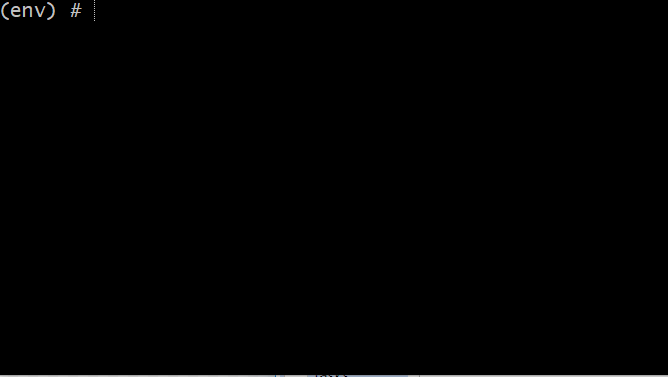

# My Development/Feature Testing Environments

Docker images based on Alpine for Interactive use.

The following 4 docker images are here:

* Generic: c/c++/python/go
* Typescript
* JDK8 & JDK11

all images have installed:

"mkit" (my build tool) and "devops kit" (my collection of devops scripts)

Example of installing "terraform" from  bundled devops-kit:

